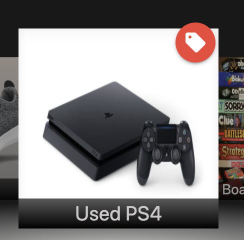

# Bartertown
## Table Contents  
* [Overview](#overview)
* [Getting Started](#getting-started)
* [Technologies Used](#technologies-used)
* [Screenshots](#screenshots)
* [Development](#development)  
  * [Early Design Layout Wireframes](#early-design-layout-wireframes)
  * [Original Entity Relational Diagram](#original-entity-relational-diagram)
  * [Future Additions](#future-additions)
---
---

## Overview  
*Bartertown* is an online trading site where users may find anything another user is wanting to trade and can propose their own trades. Once a trade has been proposed, other users may leave comments on the item's show page as well as make a bid or bids for that item with their own items. Those bids can also be commented upon by the community users. If the owner of the original trade proposal likes one of the bids, they can then decide to make a deal, which will create a private line of communication between the two users and will remove both items of the trade from the community.

---
---
## Getting Started  
Explore 
[Bartertown here](https://bartertown22.herokuapp.com/)  

---
View the 
[Trello](https://trello.com/b/P49WDDj9/barter-town/) board with wireframes and ERD.

---
---
## Technologies Used  
Javascript, HTML, CSS, Node.js, Express.js, MongoDB, Mongoose.js, Multer.js, Passport.js and Materialize. 

---
---
## Screenshots

#### Landing page show community trades
 
#### Displays for trade proposals, bids and deals
 
#### A trade show view
 
#### A trade show view with a bid
 
#### Making a deal
 
#### Trade proposal and bids have stats and can have comments
 
#### Get notifications for new bids on your trade proposals
 

---
---
## Development  
### *Early Design Layout Wireframes*:  
  

  
 
### *Original Entity Relational Diagram*: 
   

---
### *Future Additions*:  
* Ability to edit and delete comments
* New comment flags for the owner of the proposal or bid
* Ability to add catagories to a trade proposal
* Ability to sort community trade proposals by catagory, user, or time
* Further develop visuals
